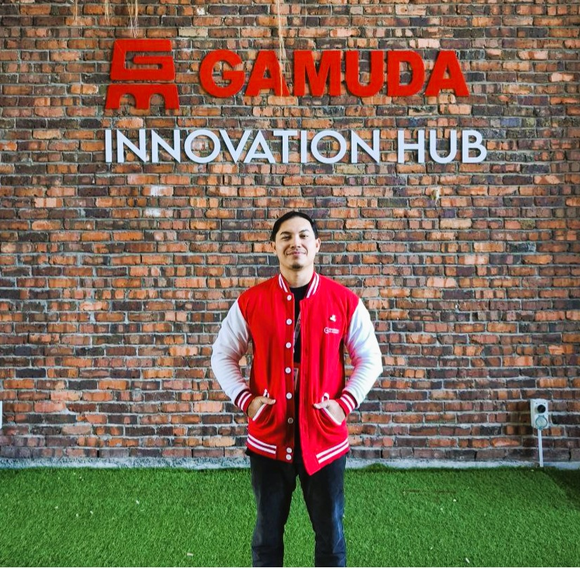

<head>
  <meta charset="UTF-8">
  <meta name="viewport" content="width=device-width, initial-scale=1">
  <meta name="description" content="Azinuddin Azlani - Software Engineer and AI Specialist">
  <link rel="stylesheet" type="text/css" href="style.css">
</head>

  

# AZINUDDIN AZLANI

## 📌 Contact Information
📍 Bangsar, Kuala Lumpur  
💼 [LinkedIn Profile](https://www.linkedin.com/in/azinuddinazlani/) | 🌐 [GitHub Profile](https://github.com/azinuddinazlani)  
📧 *Email available via LinkedIn or upon request*

---

## 👨‍💻 Professional Summary
Software & AI Engineer with experience in **platform support and technical troubleshooting**. Skilled in Python, Kubernetes, and cloud technologies. Recently completed Full Stack Software Development certification with focus on AI applications.

---

## 💼 Professional Experience

### 🚀 Platform Experience Analyst
**Accenture** | *September 2021 – December 2024*

- Provided email support to application platform developers, leveraging **Salesforce CRM** to track and manage cases, ensuring timely responses in adherence to SLAs
- Performed detailed application reviews and in-depth research to provide high-quality policy and product support, using technical knowledge to troubleshoot effectively
- Collaborated with cross-functional teams to resolve issues efficiently, maintaining a focus on improving End User Satisfaction and minimizing resolution time
- Identified opportunities and collaborated on projects to improve support tools, processes, and workflows, enhancing operational efficiency and user experience

### 📞 Customer Service Representative
**TDCX** | *September 2020 – July 2021*

- Efficiently managed incoming emails, inquiries, and calls from Shopee users, ensuring timely and accurate responses to their needs
- Utilized **Salesforce** to track customer interactions, manage cases, and provide personalized support
- Consistently met or exceeded Service Level Agreements (SLAs) to ensure customer satisfaction and operational efficiency
- Utilized technical skills, as needed, to troubleshoot issues and provide solutions to customers

### 📋 Case Executive
**Family First Consultancy** | *March 2020 – May 2020*

- Provided support to counselors with daily tasks, including session preparation and logistical setup, to ensure a seamless client experience
- Managed counseling and program-related documentation, such as confidentiality agreements, client demographic forms, session notes, and program materials
- Maintained an organized and conducive office environment, enhancing the overall satisfaction of clients with the counseling sessions provided

### 📂 Executive Administration
**Tan Norizan & Associates** | *December 2019 – March 2020*

- Managed the Administration team, serving as a key liaison between the team and external Partners to ensure seamless communication and collaboration
- Assisted the Managing Partner of the Litigation Team by overseeing daily operations, monitoring team performance, and supporting business development efforts to promote the firm
- Provided support to all Partners of the Litigation Team by coordinating the production of newsletters, managing the Buddy System, drafting internal memos, and handling other essential communications

---

## 🎓 Education

### FULL STACK SOFTWARE DEVELOPMENT CERTIFICATION
**Gamuda AI Academy**

### BACHELOR OF COUNSELING (HONS)
**Management & Science University**

### DIPLOMA OF BUILDING SURVEY
**UiTM Sri Iskandar**

---

## 🏆 Achievements

- Developed an **AI-powered web application** for HR recruiters, effectively addressing key challenges in talent acquisition and management (Capstone Project) - 2025
- Successfully completed the **Fullstack Software Engineering program** at Gamuda AI Academy, enhancing technical expertise and proficiency in software development - 2025
- Achieved **Certified Kubernetes Administrator (CKA)** certification - 2024
- Built webapp as group final project for Convergence Certification and Skills Development (CCSD) certificate - 2024
- Selected as Yayasan Peneraju's scholar for **Peneraju Teknologi Certified DevOps Practitioner** program - 2024

---

## 💡 Skills & Highlights

### Languages
- **Native Malay**: Superior in speaking and writing
- **Professional English**: Good at speaking and writing
- **Basic Indonesian**: Good at speaking and understanding

### Technical Skills
- **Operational Knowledge**: Salesforce, Google Cloud Platform, MongoDB, GitHub
- **Proficient**: Python, Kubernetes, Linux, AI, SQL
- **Basic Knowledge**: JavaScript, Vue.Js/Vuetify, Docker, ML

### Interpersonal Skills
- ✅ A proactive, passionate, and committed worker
- ✅ Self-motivated and hard-working individual
- ✅ Remains calm in stressful situations
- ✅ Positive and strong work ethic
- ✅ Enjoy working as a team member as well as independently
- ✅ Good at communicating with a diverse group of people
- ✅ Fast learner, adaptable, and flexible to technology changes

---

## 📄 Download Resume

  <a class="resume-download" href="./Azinuddin_Azlani_2025_Resume.pdf">📄 Download My Resume</a>

---

*References available upon request*